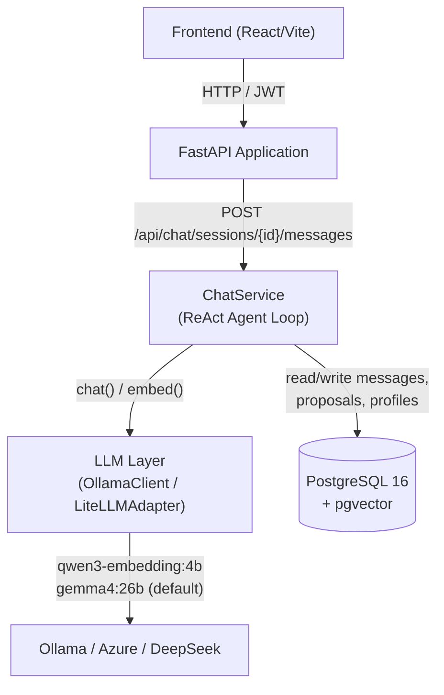
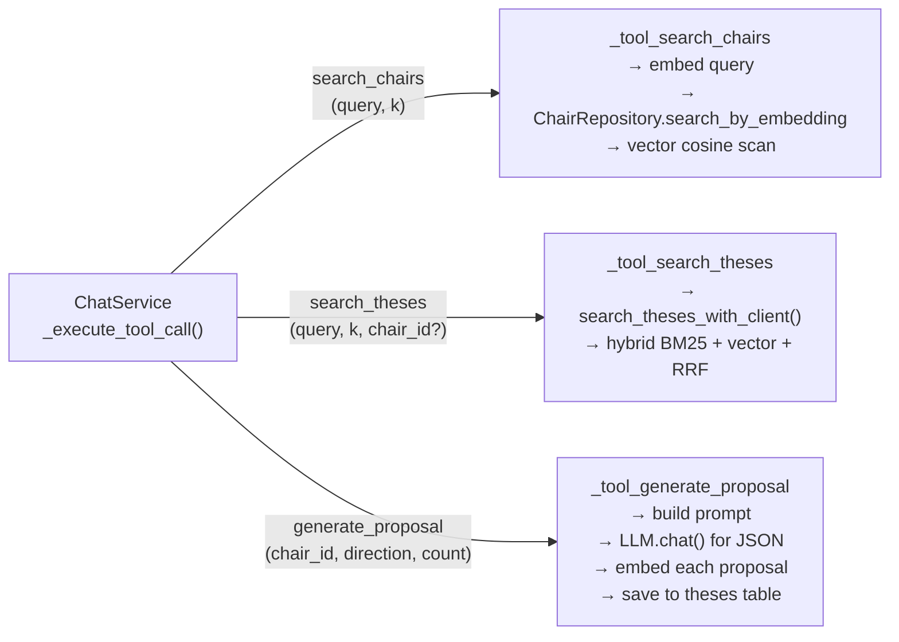
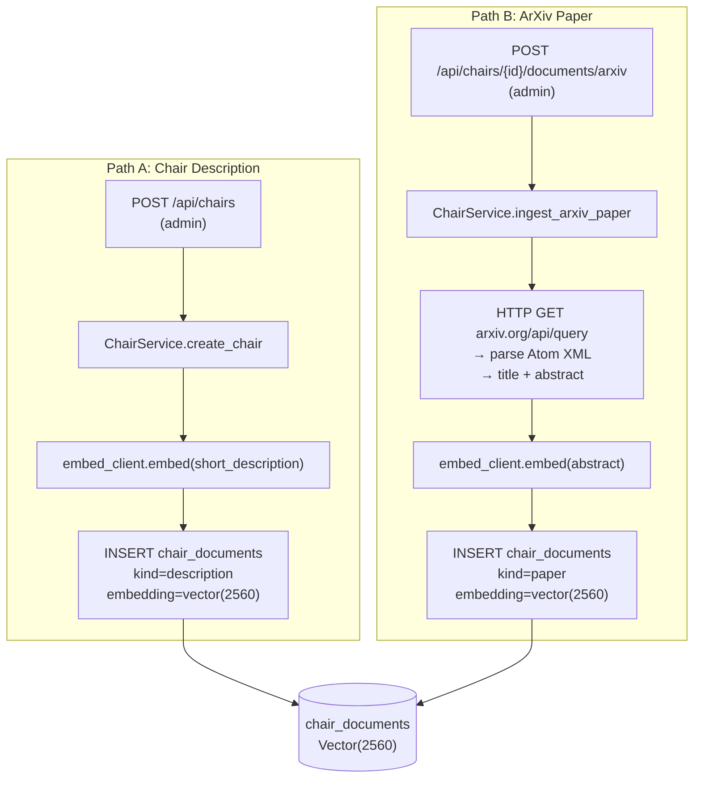
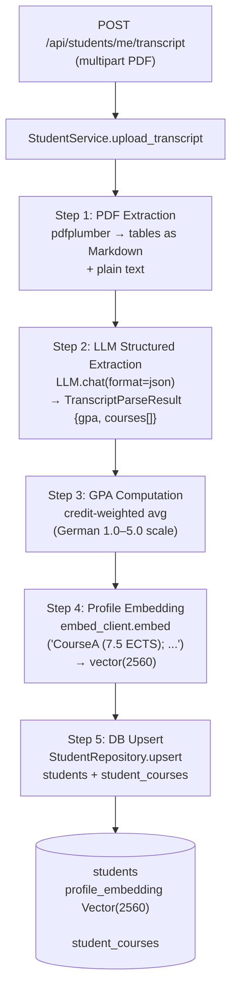
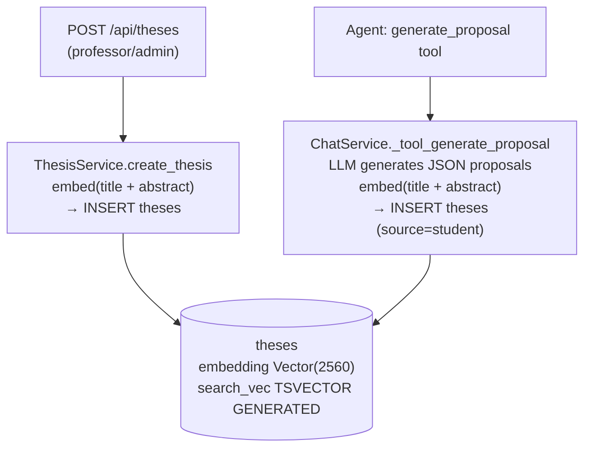
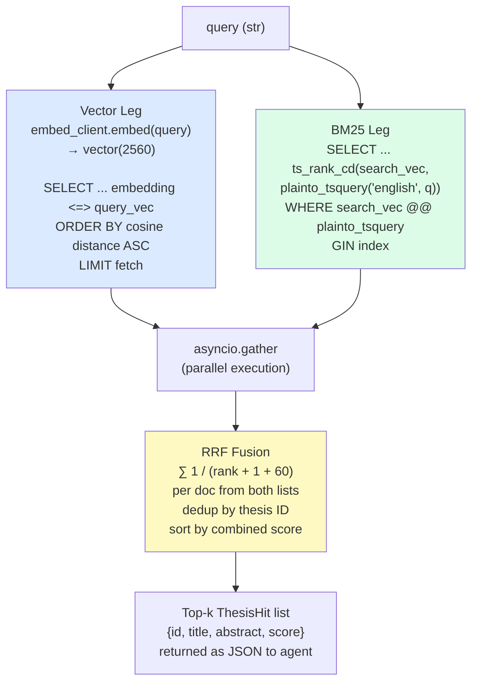
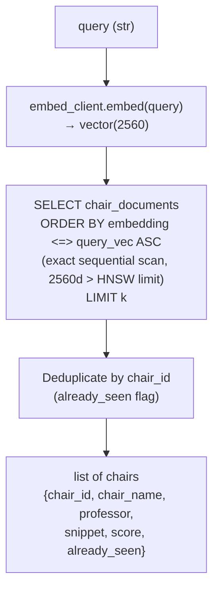
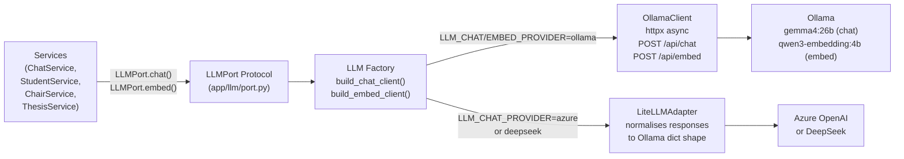
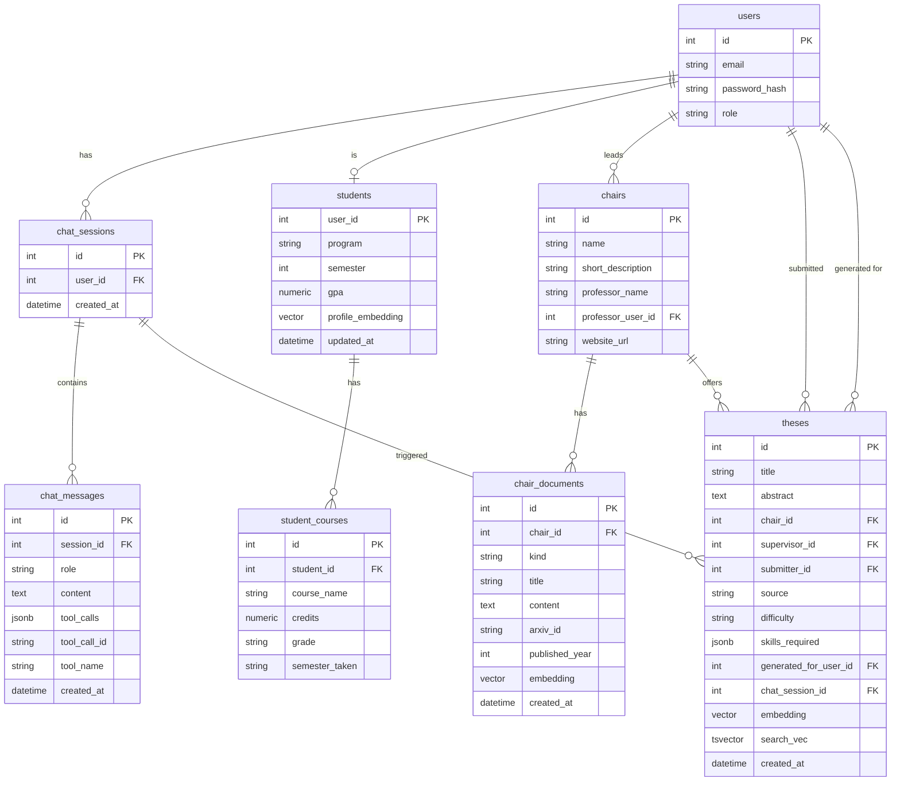
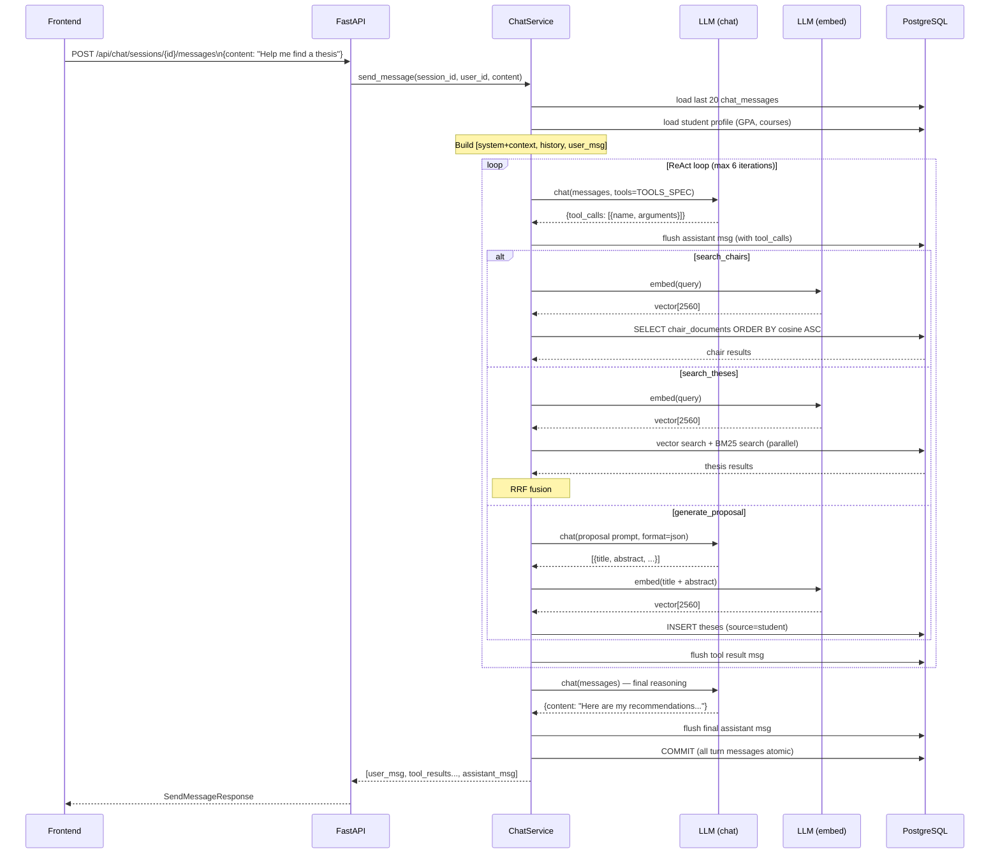

# Agent Architecture & RAG Pipeline

This document gives an overview of how the AI agent and retrieval-augmented generation (RAG) pipeline work together in the Study-OS thesis advisor backend.

---

## 1. High-Level System Overview



---

## 2. Agent Loop (ReAct Pattern)

The agent follows a **Reason → Act → Observe** cycle capped at **6 iterations** per user message.

```mermaid
flowchart TD
    START(["User sends message\nPOST /messages"])
    CTX["Load student context\n(GPA, program, courses)"]
    HIST["Load chat history\n(last 20 messages)"]
    BUILD["Build message array\n[system+context, history, user_msg]"]
    LLM_CALL["LLM.chat(messages, tools=TOOLS_SPEC)"]
    HAS_TOOLS{Tool calls\nin response?}
    EXEC["Execute tool calls\n(search_chairs / search_theses / generate_proposal)"]
    PERSIST_TOOL["Persist: assistant msg\n+ tool result msgs to DB"]
    APPEND["Append results to\nmessage array"]
    MAX{Max iterations\nreached? (6)}
    PERSIST_FINAL["Persist final\nassistant text to DB"]
    COMMIT["Commit transaction\n(all turn messages atomically)"]
    RETURN(["Return all new messages\nto frontend"])

    START --> CTX --> HIST --> BUILD --> LLM_CALL
    LLM_CALL --> HAS_TOOLS
    HAS_TOOLS -- "Yes" --> EXEC --> PERSIST_TOOL --> APPEND --> MAX
    MAX -- "No" --> LLM_CALL
    MAX -- "Yes (force stop)" --> PERSIST_FINAL
    HAS_TOOLS -- "No (plain text)" --> PERSIST_FINAL
    PERSIST_FINAL --> COMMIT --> RETURN
```

---

## 3. Agent Tools

The agent has three tools available, declared as `TOOLS_SPEC` in `app/chat/service.py`.



---

## 4. RAG Pipeline — Document Ingestion

There are three separate ingestion paths feeding the knowledge base.

### 4.1 Chair Knowledge Base



### 4.2 Student Profile Embedding



### 4.3 Thesis Embedding (professor-created & AI-generated)



---

## 5. RAG Pipeline — Retrieval

### 5.1 Hybrid Thesis Search (BM25 + Vector + RRF)

`app/tools/search_theses.py` — called by the `search_theses` agent tool.



**Fallback behaviour:** If Ollama is offline → BM25 only. If no BM25 hits → vector only. Both empty → `[]`.

### 5.2 Chair Semantic Search

`app/chairs/repository.py` — called by the `search_chairs` agent tool.



---

## 6. LLM Provider Layer



Two independent client singletons are created at startup and stored in `app.state`:
- `llm_chat_client` — used for the agent loop and proposal generation
- `llm_embed_client` — used for all embedding calls

---

## 7. Data Models & Storage



---

## 8. Request Flow: Full Chat Turn

End-to-end flow from user message to response, showing all layers.



---

## 9. Key Design Decisions

| Decision | Details |
|---|---|
| **ReAct-style single agent** | One `ChatService` agent, no multi-agent orchestration. The LLM decides which tools to call; tool results are fed back into context. |
| **Port-adapter for LLM** | `LLMPort` Protocol decouples all business logic from the LLM provider. Swap Ollama → Azure with an env var. |
| **Dual LLM clients** | Separate `chat_client` and `embed_client` singletons allow mixing providers (e.g., DeepSeek for chat, Ollama for embed since DeepSeek has no embed API). |
| **Hybrid search (BM25 + Vector + RRF)** | Thesis search combines lexical (PostgreSQL tsvector/GIN) and semantic (pgvector cosine) signals, fused with Reciprocal Rank Fusion. Runs both legs in parallel. |
| **Sequential scan for vectors** | Embedding dimension is 2560 (qwen3-embedding:4b), which exceeds pgvector's HNSW/IVFFlat limit of 2000. All vector searches use exact sequential scan — acceptable at research-project scale. |
| **Atomic message commits** | All messages in a single agent turn are flushed during the loop but committed in one transaction at the end, preventing partial turns from appearing in history on failure. |
| **Student context injection** | Student GPA and course list are injected into the system prompt every turn — the agent does not need a "get profile" tool call. |
| **Generated proposal traceability** | Each AI-generated thesis in `theses` carries both `generated_for_user_id` and `chat_session_id`. |
